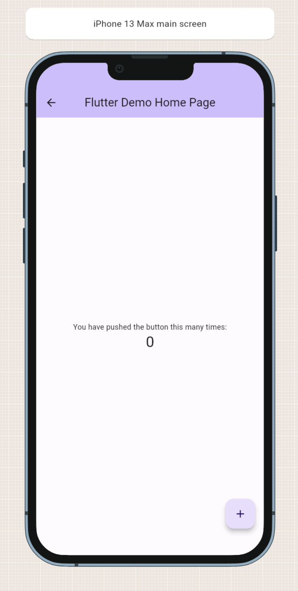

# Catalog

This package allows you to create a widget catalog. Every widget page of your catalog can display one or more samples of your widget.

*Where do I see this catalog?* After you prepare your widgets, you must run your app and go to `/catalog`.

> This package uses `go_router` to simplify the navigation. If you aren't using this package, you can run
> the `CatalogApp` to run it.

> This package doesn't render your widgets in IDEA, Android Studio, or Visual Studio Code.

### [Installation](https://github.com/landamessenger/catalog/wiki/Installation)

### [Previews](https://github.com/landamessenger/catalog/wiki/Previews)

[- What are previews?](https://github.com/landamessenger/catalog/wiki/Previews#what-are-previews)

[- Create a basic page for a widget](https://github.com/landamessenger/catalog/wiki/Previews#create-a-basic-page-for-a-widget)

[- Generate the preview and dummy files](https://github.com/landamessenger/catalog/wiki/Previews#generate-the-preview-and-dummy-files)

### [Dummies](https://github.com/landamessenger/catalog/wiki/Dummies)

[- What are dummies?](https://github.com/landamessenger/catalog/wiki/Dummies#what-are-dummies)

[- Complex page catalog](https://github.com/landamessenger/catalog/wiki/Dummies#complex-page-catalog)

[- Prepare dummies](https://github.com/landamessenger/catalog/wiki/Dummies#prepare-dummies)

### [Build & Run](https://github.com/landamessenger/catalog/wiki/Build-&-Run)

[- Building your catalog](https://github.com/landamessenger/catalog/wiki/Build-&-Run#building-your-catalog)

[- Run with go_router](https://github.com/landamessenger/catalog/wiki/Build-&-Run#run-with-go_router)

[- Run without go_router](https://github.com/landamessenger/catalog/wiki/Build-&-Run#run-without-go_router)

### [Catalog Sample](https://landamessenger.com/catalog)

